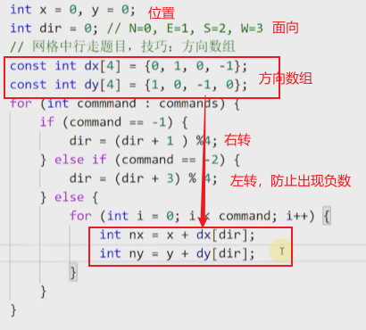
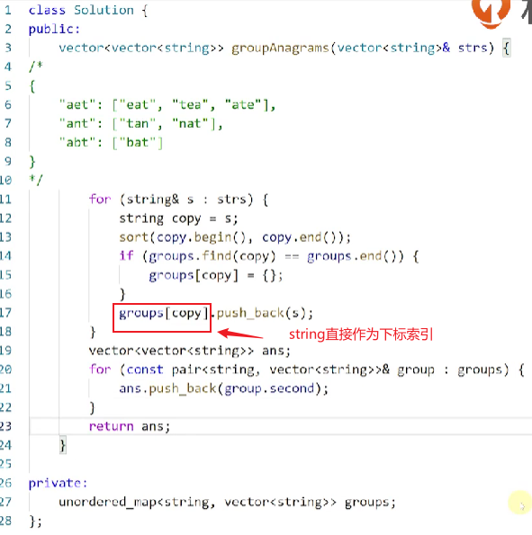

## 第二周|哈希表、集合、映射

### 哈希表、无序集合与映射

映射（map）——一种容器，接口 可以使用哈希表实现 

哈希表——是一种数据结构，映射map的一种实现方法

作业：了解一些高级语言中的无序列表（映射）是如何实现的

### 应用实战

可以应用到实战中的前提：对于高级语言中相应数据结构所支持的操作非常熟悉——》第一节课中关于所列举的各语言中的数据结构的深入了解

#### C++

c++STL中的两个主要关联容器：map和set

set支持高效的**关键字查询**操作，当只是想知道一个值是否存在的时候最有用	

#### 例题1 [两数之和](https://leetcode.cn/problems/two-sum/description/)

[][https://leetcode.cn/problems/two-sum/description/]

**思路分析：**

<u>最朴素的思路</u>：两层循环暴力枚举 O(n^2)

<u>稍做优化</u>：考虑到内外两层下标的无序性，即对于最终结果而言，（i，j）与（j，i）是相同的，所以 外层循环0-i，内层0-(i-1)，可以减少一半的循环

<u>进一步优化分析（多重循环枚举一层层地优化）</u>：固定外层循环，对内层循环进行进一步的优化——对于给定的外层i值，对于内层循环而言，就是看在0-(i-1)中是否可以找到某个数为target-nums[i]，即转换成了给定范围内的**查询**问题，使用**集合**，实现不断向集合中插入数并查询某个数是否在集合之中；又因为需要得到下标序号，所以还需要在集合的基础上增加下标的附加信息，需要使用下标与数值之间的**映射**来实现

#### 例题2 [模拟行走机器人](https://leetcode.cn/problems/walking-robot-simulation/)

问题关键：如何判断某个位置是否有障碍物

思路①  存储每个格子的是否为障碍物的信息，此时分析内存消耗，根据题目所给的数据规模信息可知，开二维数组所需的内存消耗过大，不合理（一般认为程序的空间消耗在**百兆**数量级是合理的）

思路②  使用集合来存储障碍物的信息实现快速判断某个格子是不是障碍物（集合实现查找非常高效）——》语言并未自带对于vector的hash，所以需要自己定义hash方法——》将数组转换成语言支持的hash数据类型——》① 简单地转换成字符串类型，将二维数组类型数据拼接成字符串；②考虑**将二维数组值转换成一维表示**——行号乘以列数加列数，不过需要注意题目中的范围，对于负数坐标需要平移成正数坐标范围

**小技巧——关于在方格中行走问题**

使用方向数组

#### 例题3 [字母异位词分组](https://leetcode.cn/problems/group-anagrams/)

**分组**与**hash**是具有相似性的

关键——hash函数的设计

​	想法① 自己设计hash函数，利用单词的各个字母的ASCⅡ码和，但是冲突会较为频繁，所以并不合适；——**设计hash的时候需要考虑可考虑范围内的唯一性**

​	 想法② 利用**语言自带的对于string类型的hash函数** 为了使得同一组字母异位词的hash结果一致，对单词正序重排（使用自带的sort()函数进行排序）后的结果hash 

#### 例题4 [串联所有单词的字串](https://leetcode.cn/problems/substring-with-concatenation-of-all-words/)

思路分析：

问题解，即子串的基本特征——长度等于words拼接的字符串的长度的字串才有可能，所以可以枚举所有该长度的子串分别判断是否符合提议要求，即**比较两个map是否相等**

重要代码模块——判断两个map是否相等！！！

解法优化——==滑动窗口（待解决）==

#### 例题5 [LRU缓存](https://leetcode.cn/problems/lru-cache/)

思路分析：根据LRU缓存的性质，需要使用两种数据结构来按照两种顺序维护数据——使用链表按照时间顺序存储、使用映射按照关键字顺序存储

代码实现关键点：

1. 对于map的**查找是基于关键词key的**，所以链表结构体中还必须保存key值，不能仅仅保存value值

2. 容易忽略cache的LRU策略的即时更新的性质，即每当put或者是get某个数据之后该值就是”刚被使用“的状态，放到链表首部位置

3. 要实现对链表中任意一特定位置元素的删除操作，必须得是使用双向链表，单向链表无法实现

4. 双向链表，**首尾分别设置空节点**使得首位与中间部位的增删操作代码保持一致性，避免了很多不必要的麻烦！！！

