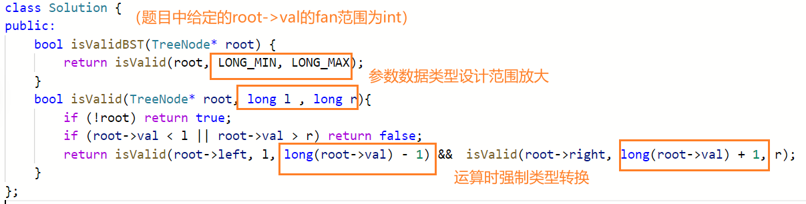

#### 例题 [子集](https://leetcode.cn/problems/subsets/)

思路分析：子集构建的所有方案是一颗二叉树，每个节点处是集合中的某个元素是否选择；集合中所有元素选或不选构成了一个子集方案

关键：**还原公共的记录变量**，结合状态树去分析

#### 例题 [组合](https://leetcode.cn/problems/combinations/) 

思路——**递归实现组合型枚举**：与上一个子集的例题相同，仅仅是递归函数的**边界条件**不同

注意**根据逻辑提前剪枝**，提前退出递归，可以大大提高程序的效率

没有剪枝的程序时间复杂度为 O(2^n) 剪枝之后降为 O(k * C(n,k))

#### 例题 [全排列 ](https://leetcode.cn/problems/permutations/)

注意， 与组合问题不同的是 每一层递归的处理是从尚未使用的数中选择一个而不是某个数的选或不选

#### 相似例题 [全排列 II](https://leetcode.cn/problems/permutations-ii/)

与上一题的唯一不同就是所给的原始数组**存在重复的元素**

要解决重复问题，我们只要设定一个规则，保证在填第 idx 个数的时候重复数字只会被填入一次即可。即，<u>先对原数组排序，保证相同的数字都相邻</u> 然后在每一层选择的时候只考虑相邻重复元素中的一个即可；（理解——每一次递归函数中就是为全排序序列中的某一特定位置的元素考虑，而重复就是在同一位置将相等的数字分别考虑多次引起的，联想递归树的结构）

#### 例题 [验证二叉搜索树](https://leetcode.cn/problems/validate-binary-search-tree/)

关键点：

1. 理解好二叉搜索树的定义，根节点的值需要大于或小于左右子树的所有节点而不仅仅只是根节点自己的左右孩子！！

2. 递归函数的设计：需要在递归中传递的信息，可以使用**函数返回值** / **函数参数**来在调用中传递

3. 当接近数据类型边界的数据进行加减运算的时候很容易出现**溢出**的情况，如int 类型的数据，出现边界的测试数据使得程序中出现溢出——》在程序中声明的数据类型需要声明范围更大的数据类型 如 long，同时 需要对于某些变量在运算之前进行i强制类型转换；

   如：

   

   **附**：语言中自带的特定数据类型最值范围及其常量表示

   int ：- (1 << 31) -- (1 << 31) - 1，即 - 2147483648，2147483647

   int 最大值：2147483647
   int 最小值：-2147483648
   float 最大值：3.40282e+38
   float 最小值：1.17549e-38
   double 最大值：1.79769e+308
   double 最小值：2.22507e-308
   long 最大值：9223372036854775807
   long 最小值：-9223372036854775808
   long long 最大值：9223372036854775807
   long long 最小值：-9223372036854775808
   unsigned long long 最大值：18446744073709551615

   

   **C++　中最值常量表示：**

   ```c++
   #include <iostream>
   #include <climits>
   #include <cfloat>
   
   using namespace std;
   
   int main() {
       cout << "int 最大值：" << INT_MAX << '\n';
       cout << "int 最小值：" << INT_MIN << '\n';
       cout << "float 最大值：" << FLT_MAX << '\n';
       cout << "float 最小值：" << FLT_MIN << '\n';
       cout << "double 最大值：" << DBL_MAX << '\n';
       cout << "double 最小值：" << DBL_MIN << '\n';
       cout << "long 最大值：" << LONG_MAX << '\n';
       cout << "long 最小值：" << LONG_MIN << '\n';
       cout << "long long 最大值：" << LONG_LONG_MAX << '\n';
       cout << "long long 最小值：" << LONG_LONG_MIN << '\n';
       cout << "unsigned long long 最大值：" << ULONG_LONG_MAX << '\n';
   }
   
   ```

   

#### 例题 [二叉树的最大深度](https://leetcode.cn/problems/maximum-depth-of-binary-tree/) & [二叉树的最小深度 ](https://leetcode.cn/problems/minimum-depth-of-binary-tree/)

求解最大深度——思路① 自底向上；思路② 自顶向下

求解最小深度——直接类似套用求最大深度的代码，出错，对于求最大深度时候的递归边界判断是nullptr，但是考虑到特殊的情况——当树完全退化成线性结构的时候，树的最小高度并不是1；只有没有子节点的子节点才是叶子节点，而定义的深度是根到叶结点的路径长度，此种情况下的根节点并不是叶子节点！！！——修改递归边界的判断条件

#### 例题 [Pow(x, n)](https://leetcode.cn/problems/powx-n/)

关键：

1. 当**指数 n 为负数**时，我们可以**先计算 x^(-n) 再取倒数**得到结果，即只需要在递归边界做处理即可，而不需要考虑在每一层递归的时候处理，因此我们只需要考虑 n 为自然数的情况
2. 边界特殊取值的考虑：底数为0，指数为0 不能有所遗漏
3. 对于取值范围在 int 边界的值需要格外注意，- INT_MIN超出了int 类型数据范围，需要做处理之后再做转换

#### 例题 [括号生成](https://leetcode.cn/problems/generate-parentheses/)

解法1. 纯粹递归解法，仿照 组合 类问题设计递归函数实现所有有效组合的枚举；当有尚未匹配右括号的左括号的时候才可以选择在末尾插入右括号；

解法2. 分而治之，分——寻找分割点，使得每个部分是不可划分的整体