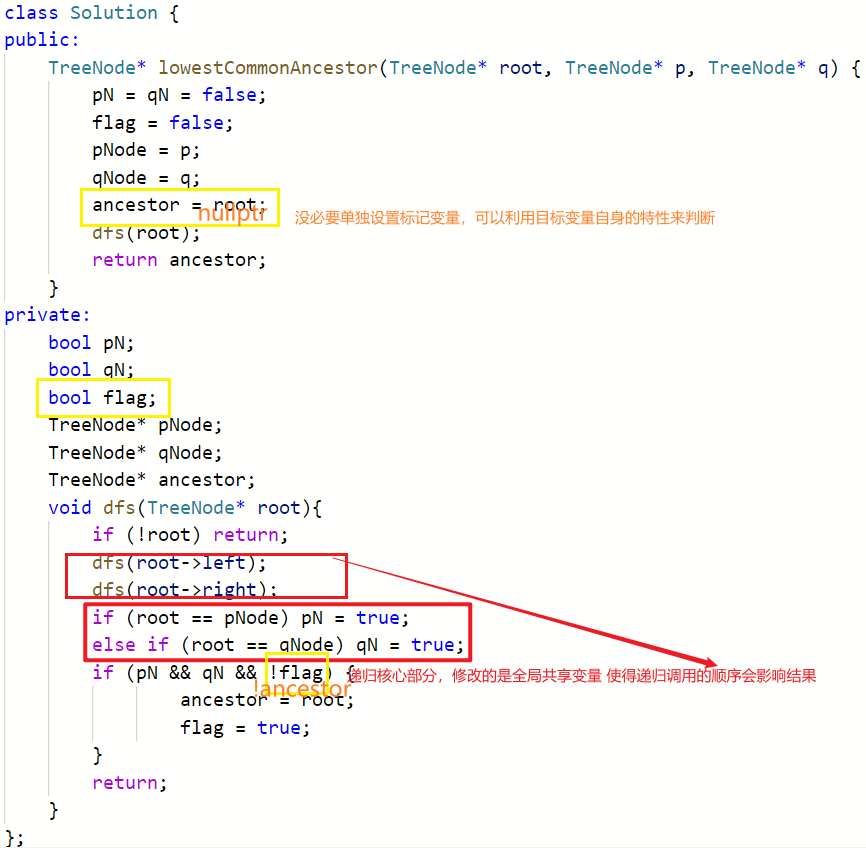

#### 例题 [N叉树的层序遍历](https://leetcode.cn/problems/n-ary-tree-level-order-traversal/)

分组的依据是**层数**，一层为一个vector

#### 例题 [已知前序遍历+中序遍历序列还原二叉树](https://leetcode.cn/problems/construct-binary-tree-from-preorder-and-inorder-traversal/)

充分利用树的**递归**特性

#### 例题 [二叉树的序列化与反序列化](https://leetcode.cn/problems/serialize-and-deserialize-binary-tree/)

题意分析：就是想要将一棵树按照某种遍历顺序来存储并支持唯一地还原，即同时**对其值和其结构进行编码**——》考虑利用上一题的思路，记录前/后序遍历序列+中序遍历序列结果，此题未说明所给树中的**元素不重复**，所以无法实现唯一地还原，所以不合适；——》考虑**在前序遍历序列的基础上增加一些信息**，从而使得可以从线性序列**唯一还原**出树的结构：即，在空子树的位置增加null标记

关键点：

1. string与int类型的相互转换方法（C++）

   string 到 int——stoi()函数 [详细参数](https://www.cnblogs.com/tsruixi/p/12944470.html)

   int 到 string ——to_string()函数 

2. **string**按照特定的字符为界线的**分割**方法

   方法① 使用**string流对象** 与 C++ std::getline() 完成字串分割功能

   先將 `std::string` 建立 `std::stringstream`，再用 `std::getline()` 來處理`std::stringstream`，將每一次取出的字串放到 `std::vector`，最後再回傳這個結果 `std::vector<std::string> result`，這種方式的好處是原字串不會被修改，

   ```c++
   		stringstream ss(data); // data为原始待分割字符串
           string tok; // 分割后的局部字符串结果
           const char &delimiter=','; //分隔符
           while (getline(ss, tok, delimiter))
               if(!tok.empty()) result.push_back(tok);
   ```

   ```C++
   #include <iostream>
   #include <string>
   #include <sstream>
   int main(){
       std::string myText("some-text-to-tokenize");
       std::istringstream iss(myText);
       std::string token;
       while (std::getline(iss, token, '-'))
       {
           std::cout << token << std::endl;
       }
       return 0;
   }
   ```

   方法② C++ std::string::find() + std::string::substr() 完成字串分割功能

   其中，std::string::find 搜尋字串——如果有找到的話會回傳找到的位置，如果沒有找到會回傳 string::npos

   ```c++
   	const std::vector<std::string> split(const std::string& str, const std::string& pattern) {
       
       std::vector<std::string> result;
       std::string::size_type begin, end;
   
       end = str.find(pattern);
       begin = 0;
   
       while (end != std::string::npos) {
           if (end - begin != 0) {
               result.push_back(str.substr(begin, end-begin)); 
           }    
           begin = end + pattern.size();
           end = str.find(pattern, begin);
       }
   
       if (begin != str.length()) {
           result.push_back(str.substr(begin));
       }// 尾部无分隔符，收集剩余部分的局部字符串
       return result;        
   }
   ```

   方法 ③ 逐个遍历字符

   ```c++
           string str;
           for (auto& ch : data) {
               if (ch == ',') {
                   result.push_back(str);
                   str.clear();
               } else {
                   str.push_back(ch);
               }
           }
   ```

3. string 拼接

   - “+” ：

   注意：使用str += "a"， str =str+ "a" 效率差距很大——str =str+ "a"加的运算产生的是一个新的对象，再把结果返回，而str += "a" 涉及到的应该是对象的引用，操作之后**直接返回引用**，避免了产生新的对象。因此，两者的性能有一定的差距

   - append() 方法：str1. append(ste2) 效率和 str =str+ "a" 相同

4. string 大小比较方法

   [c++中三种常用比较方法总结](https://blog.csdn.net/qq1539543073/article/details/114213997) 

   注意：C++中可以直接使用比较运算符<，>，== 来比较字符串大小，而有一些语言如Java中就不可以

5. 程序编写的低级bug！！！递归**函数传参**，欲在单次递归中改变参数的值，简单的传值参数无效，需要使用引用参数或者是全局变量

#### 例题 [二叉树的最近公共祖先](https://leetcode.cn/problems/lowest-common-ancestor-of-a-binary-tree/)

思路分析：

1. 基本思路：选取其中一个节点，向上标记其所有祖先；再向上寻找另一个节点的所有祖先，第一个已被标记的祖先即为所求；其中某个节点的祖先的寻找：使用额外的空间开销，先遍历一遍整棵树，记录每个节点的父亲节点——》效率较低；
2.  深度优先遍历整棵树，寻找最深的一个子树使得其同时包含两个节点，则该子树的根节点即为所求；

关键点：递归函数的实现

